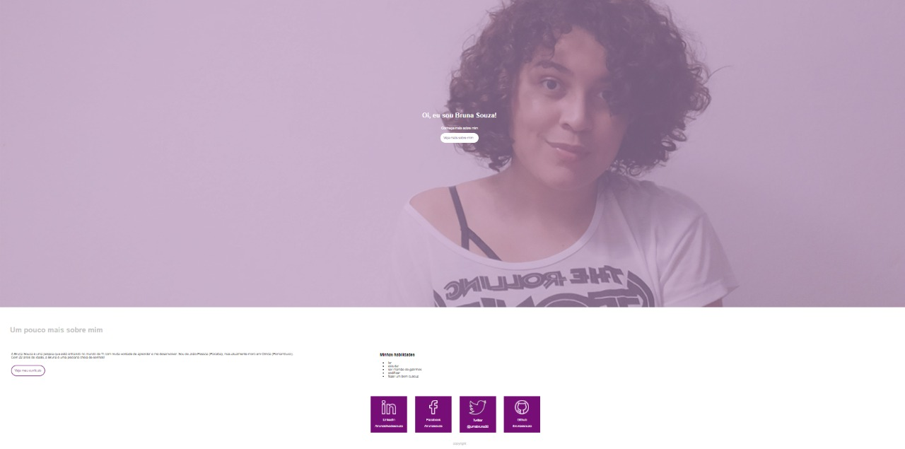

# Projeto Workshop {Reprograma} :purple_heart:

# O que é?
O projeto foi criado durante o Workshop do {Reprograma} da turma de Front-end, onde foi criado um site de portfólio profissional.

# Como foi feito?
Para a criação desse site foram utilizadas a linguagem de marcação (HTML) e o mecanismo de estilo (CSS) pelo editor de código-fonte Visual Studio Code. Com essa oficina, foi possível aprender diversos conceitos relacionados ao HTML e o CSS.
O arquivo index.html ficou registrado todo o "esqueleto" do código, ou seja, o HTML. Já o arquivo estilo.css dar estilo ao código criado pelo HTML.
Além de ganhar conhecimentos, construímos o portfólio que irá complementar um pouco da minha história profissional.

Confira o visual do site construído:

Para conferir o site construído através desse projeto, <a href="https://primeiro-site-bruna-souza.netlify.app/" target='blank'>clique aqui </a> .  